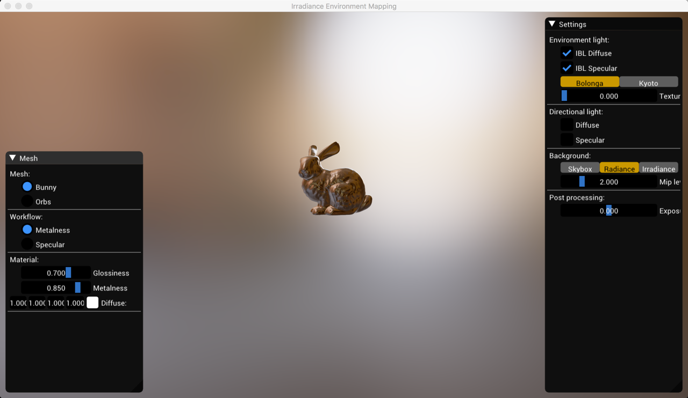

Use code GPU Pro3
Use code lerning OpenGL 

Use code tcoppex/m2-irradiance-env-map
 Some base initialization and utility class code

Use code bgfx example 18-ibl
 GUI theme and wiget

OpenGL + GLFW + AssImp + ImGUI + GLI + FreeImage

[reference]
1. GPU Pro3
2. Lerning OpenGL

