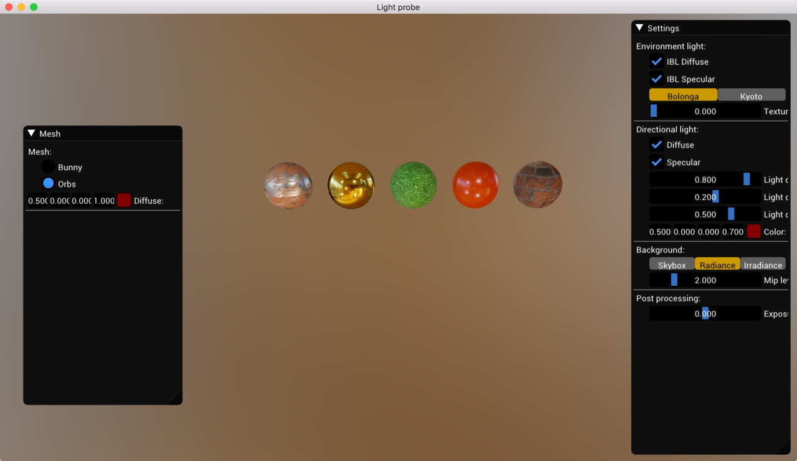

NOTE: Has BUG on prefileter or irraidance in compute shader, has dirty noise

* Use code from [2] for brdf and dynamic cube map
* Use code from [4] for split sum and pbr related code
* Use code from [5] for some gl utility
* Use code from [6] for imgui code

Use resource from freepbr.com
Use resource from artisaverb.info

OpenGL + GLFW + AssImp + ImGUI + GLI + Stbi 

[reference]
1. GPU Gem2 Chapter 10. Real-Time Computation of Dynamic Irradiance Environment Maps
2. https://learnopengl.com/PBR/IBL/Specular-IBL
3. http://holger.dammertz.org/stuff/notes_HammersleyOnHemisphere.html
4. Epic game's pbr related publication
5. tcoppex/m2-irradiance-env-map
6. bgfx example 18-ibl
7. https://placeholderart.wordpress.com/2015/07/28/implementation-notes-runtime-environment-map-filtering-for-image-based-lighting/

